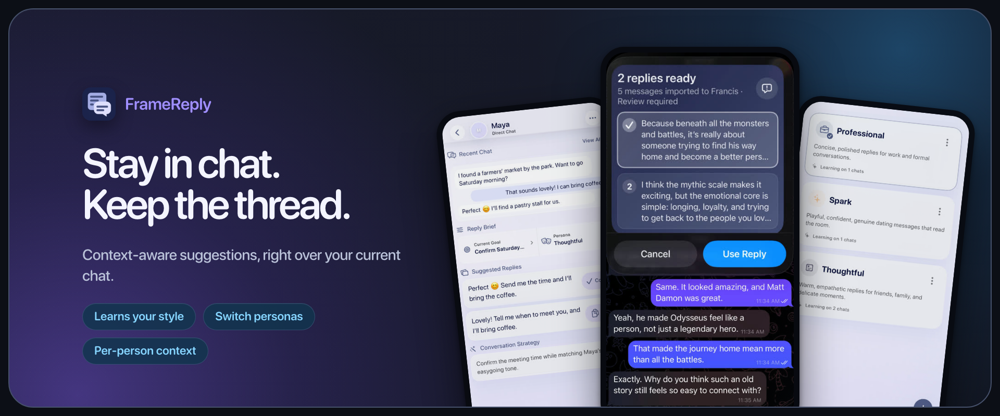

# FrameReply

FrameReply is an open-source chat assistant that delivers two context-aware reply  ideas directly on your current messaging screen using Shortcuts and snippets. It remembers useful details about each person, supports custom  personas, and adapts to your writing style. 

**Download on:** 

## Features

### Stay in Chat

- Get context-aware reply ideas in an interactive Shortcuts overlay without leaving your current messaging screen.
- Bring in chat screenshots or copied messages via Share Sheet or Shortcuts. The image shortcut can also capture the current screen or launch with Back Tap.

### Keep the thread

- Automatically add new messages to an existing chat when there is a reliable match, or add them directly to one you already have open.
- Memorize useful person-specific context, such as preferences, shared history, and recurring plans.
- Set a Current Goal for the chat, or add one-time Reply Guidance for what you want to say next.

### Make it sound like you

- Choose a built-in persona or create your own. Personas can learn recurring patterns from messages you send.
- Get Conversation Strategy and Strategy Rationale that explain why the replies were suggested.

### Stay in control

- AI suggestions are drafts. The app never sends messages for you; you choose what to copy and whether to edit or send it in your messaging app.
- Delete a chat, remove a provider connection, or erase all local data from your device whenever you choose.

## Before you start

- An iPhone running iOS 26 or later.
- Your own API key for OpenAI, OpenRouter, or MiniMax.
- Provider usage may incur charges from that provider.

## How to use

### In-app

- **On the Chats tab:** Tap the photo-and-text icon beside Search → choose **Chat screenshots** or **Copied text** (optionally add **Reply Guidance**). The app automatically adds the messages to a matching chat or starts a new chat.
- **In an open chat:** Tap the photo-and-text icon at the bottom, beside **Reply Guidance** → choose **Chat screenshots** or **Copied text**. Messages are added only to this open chat.

### With Shortcuts

- **Add once:** In the app, open **Settings → Shortcuts** and add **Image Shortcut** and **Text Shortcut**.

**Walkthrough videos:** [Image Shortcut](FrameReply/Resources/ShortcutImagesHowTo.mp4) · [Text Shortcut](FrameReply/Resources/ShortcutTextHowTo.mp4)

#### Images

- **Share a screenshot:** Take a screenshot → **Share** → **FrameReply Images**.
- **Capture the screen:** Keep the conversation visible → run **FrameReply Images**.
- **Set up Back Tap:** iPhone **Settings → Accessibility → Touch → Back Tap** → choose **Double Tap** or **Triple Tap** → **FrameReply Images**. Also, turn off **Show Banner** so it does not obscure part of the screenshot.

#### Text

- **Share directly:** Select multiple messages → **Share** → **FrameReply Text** (e.g. Telegram).
- **Copy, then run:** Select multiple messages → **Copy** (or **Share → Copy**) → run **FrameReply Text** (e.g. WhatsApp or Telegram).

Text imports require sender labels. If sharing or copying omits them, use screenshots instead.

See [Shortcuts](docs/shortcuts.md) for maintenance and troubleshooting.

## Privacy

- Chats, messages, personas, saved context, drafts, and replies are stored locally. API keys are protected in Keychain. There is no developer-operated proxy server, advertising, analytics, or tracking.
- With your consent, selected content and relevant context are sent directly to the AI provider you choose. Provider policies and charges apply.

Read the [Privacy Policy](docs/privacy.md) for complete details.

## Build and contribute

Start with the [development guide](docs/development.md), then read [CONTRIBUTING.md](CONTRIBUTING.md) before opening a pull request. The [architecture overview](docs/architecture.md) and [AI workflows](docs/ai-workflows.md) explain the system's main boundaries and data flow.

Report vulnerabilities privately according to [SECURITY.md](SECURITY.md). Use the [support guide](docs/support.md) for safe bug reports, and never share credentials, private conversations, or unredacted personal information.

## Documentation

- [Roadmap](docs/roadmap.md)
- [AI provider costs and model choice](docs/ai-provider-costs.md)
- [Development](docs/development.md)
- [Architecture](docs/architecture.md) and [AI workflows](docs/ai-workflows.md)
- [Shortcuts](docs/shortcuts.md)
- [Privacy](docs/privacy.md), [Terms](docs/terms.md), [Support](docs/support.md), and [Age Suitability](docs/age-suitability.md)

## License

Licensed under the [Apache License 2.0](LICENSE).
