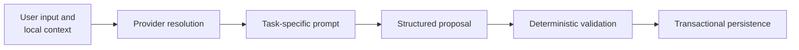
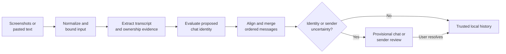
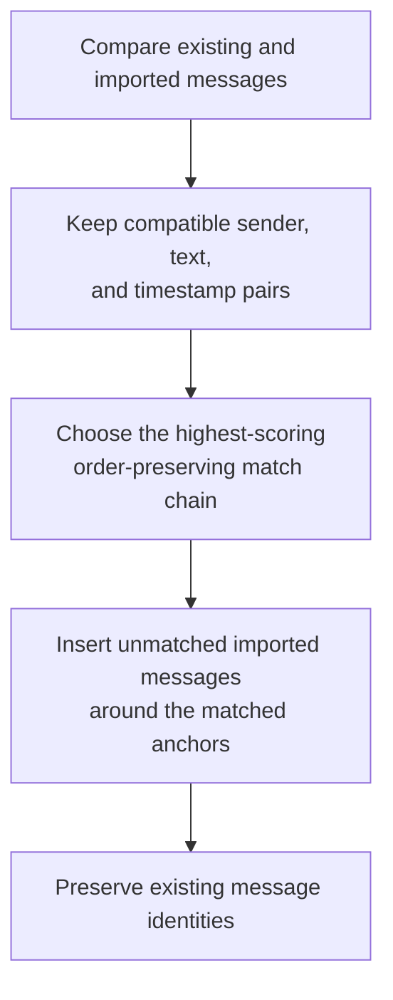
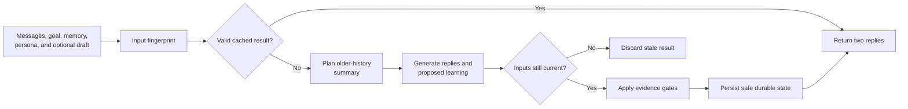

# AI Workflows

Chat import and reply generation share this execution model. They share provider infrastructure, but each workflow has its own trust rules and persistence policy.

## Shared execution model

1. The gateway selects a model that supports the requested capability.
2. Work stops before any provider request if the API key, consent, provider, or capability is unavailable.
3. Conversation content is enclosed as untrusted data; it cannot redefine the task instructions.
4. The provider must return the task's closed structured-output contract.
5. Local code validates the structure and domain rules. Invalid output fails safely instead of being partially accepted.
6. Reply results are discarded if their grounding inputs or provider selection changed during generation.
7. Only locally approved changes are committed.

This boundary is deliberate: model confidence or valid JSON alone never makes a result trusted application state.

## Chat import and reconciliation

### Extraction and ownership

Screenshots are re-encoded, stripped of metadata, and bounded before upload. Pasted text is bounded and sent without creating a separate retained copy.

Sender roles are relative to the person importing the conversation. Visible alignment, author labels, and attached delivery indicators may establish ownership; conflicting or insufficient evidence produces an unknown sender rather than a guess.

### Accepting a proposed chat match

The provider may propose an existing chat and a confidence score. FrameReply accepts it automatically only when the proposed identifier is valid, confidence meets the current `0.85` threshold, and deterministic identity evidence also supports it.

| Local evidence | Decision |
| --- | --- |
| A unique observed title or participant alias matches | Accept the proposed chat. |
| The same label belongs to multiple chats | Require strong transcript evidence. |
| A direct-chat title conflicts | Reject unless transcript evidence is strong. |
| No reliable title match | Require strong transcript evidence. |
| Evidence is missing, generic, or weak | Create a provisional chat for review. |

Strong transcript evidence requires distinctive incoming content: either a unique exact incoming message with a timestamp, or at least two unique exact matches including an incoming message. Generic overlap and outgoing messages do not establish identity by themselves.

### Aligning and merging transcripts

Alignment is a weighted sequence problem, not a set comparison. Candidate pairs must preserve order; exact text, timestamps, incoming ownership, and longer content increase their score. When alignment supports identity matching, uniqueness across chat candidates adds further weight. A narrowly fuzzy text match is allowed only for long, timestamp-matched messages.

Matched imported messages are duplicates. Unmatched messages are inserted before the next aligned anchor or appended after the final anchor, preserving existing records and adding only genuinely new history.

If the chat or sender identity remains uncertain, the import is still retained but marked for review. A user can confirm it, identify senders, or merge it into an existing chat.

## Reply generation and learning

### Grounding and cache validity

Reply content is grounded in conversation history, the current interaction goal, active chat memory, the selected persona, and optional one-use drafting input. The newest messages remain verbatim; older history is compacted through unchanged, incremental, or rebuilt summaries.

The cache fingerprint covers the conversation and every durable input that can change the result, including active memory, persona state, pending style-learning samples, provider, model, and prompt version. Any relevant change invalidates the cache.

After generation, the same inputs are checked again. A result produced from stale conversation state or a changed provider is discarded rather than persisted.

### Evidence-gated learning

Provider-proposed learning is filtered locally:

| Proposed change | Required evidence | Purpose |
| --- | --- | --- |
| Chat memory | Eligible messages from the other participant | Retain durable facts relevant to this relationship. |
| Persona observation | Repeated, previously unprocessed user-authored messages | Learn reusable writing style rather than conversation facts. |

Unsupported, duplicate, protected, or stale changes are ignored. Valid summaries, memory, persona observations, learning receipts, and cache state are persisted together.

### One-use drafting isolation

Optional drafting input can guide the immediate replies and strategy. Because it may be hypothetical or temporary, results produced with it cannot update the history summary, chat memory, or persona observations; only the immediate reply result is cached.

## Why the workflows stay distinct

| Import | Reply generation |
| --- | --- |
| Converts external conversation data into trusted local history. | Derives temporary output and narrowly controlled learned state. |
| Optimizes for identity safety, ordering, and deduplication. | Optimizes for grounding, cache correctness, and safe learning. |
| Uncertainty is exposed for human review. | Uncertainty prevents durable learning or discards stale output. |

Shared provider infrastructure does not imply shared validation. Each workflow promotes AI proposals into trusted state only through its own deterministic rules.
