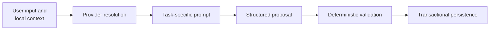
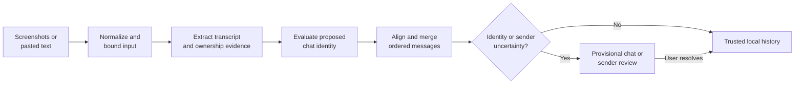
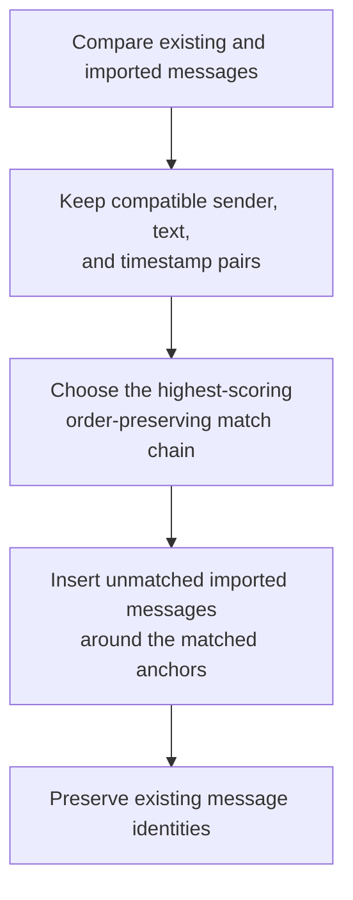
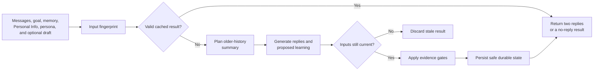

# AI Workflows

```mermaid
flowchart LR
    Input[User input and<br/>local context]
    Resolve[Provider resolution]
    Prompt[Task-specific prompt]
    Output[Structured proposal]
    Validate[Deterministic validation]
    Persist[Transactional persistence]

    Input --> Resolve --> Prompt --> Output --> Validate --> Persist
```

Chat import and reply generation share this execution model. They share provider infrastructure, but each workflow has its own trust rules and persistence policy.

## Shared execution model

1. The gateway selects a model that supports the requested capability.
2. Work stops before any provider request if the API key, consent, provider, or capability is unavailable.
3. Conversation content is enclosed as untrusted data; it cannot redefine the task instructions.
4. The provider is asked to return the task's closed structured-output contract.
5. Local code conservatively unwraps valid JSON and validates domain rules. Core output remains mandatory; invalid secondary fields degrade to safe unknown or empty values.
6. Each AI operation makes one provider request. There are no automatic repair turns or structured-output retries.
7. Reply results are discarded if their grounding inputs or provider selection changed during generation.
8. Only locally approved changes are committed.

This boundary is deliberate: model confidence or valid JSON alone never makes a result trusted application state.

For current provider rates, illustrative per-operation estimates, and model-selection guidance, see [AI Provider Costs and Model Choice](ai-provider-costs.md).

## Chat import and reconciliation

```mermaid
flowchart LR
    Source[Screenshots or<br/>pasted text]
    Normalize[Normalize and<br/>bound input]
    Extract[Extract transcript<br/>and ownership evidence]
    Match[Evaluate proposed<br/>chat identity]
    Align[Align and merge<br/>ordered messages]
    Decision{Identity or sender<br/>uncertainty?}
    Review[Provisional chat or<br/>sender review]
    Save[Trusted local history]

    Source --> Normalize --> Extract --> Match --> Align --> Decision
    Decision -->|Yes| Review
    Decision -->|No| Save
    Review -->|User resolves| Save
```

### Extraction and ownership

Screenshots are re-encoded, stripped of metadata, and bounded before upload. Pasted text is bounded and sent without creating a separate retained copy.

Sender roles are relative to the person importing the conversation. Visible alignment, author labels, and attached delivery indicators may establish ownership; conflicting or insufficient evidence produces an unknown sender rather than a guess.

Screenshot and pasted-text imports use one downstream workflow but expose different observable fields. The provider returns literal `conversationKindEvidence`; it does not return `conversationKind`. Local code validates count- and alignment-based claims, then derives the effective kind:

| Validated evidence | Effective kind |
| --- | --- |
| Explicit Group UI/member count or a Group membership event | Group |
| At least three distinct authors in structured message records | Group |
| Screenshot with at least two distinct named authors on the side opposite a known left/right owner alignment | Group |
| Group is suspected but structural proof is absent | Direct, with a non-blocking review suggestion |
| No Group evidence and at least one message | Direct |
| No recoverable participant messages | Unknown |

One- and two-author pasted fragments therefore remain Direct even when they may be partial Group history. This avoids automatically combining a Direct chat with unrelated Group content. The user can convert or explicitly merge the fragment later. Unsupported sender roles are canonicalized to unknown; named Group non-user messages become group participants, while Direct non-user messages become the single other participant.

### Accepting a proposed chat match

The provider may propose an existing chat and a confidence score. FrameReply accepts it automatically only when the proposed identifier is valid, confidence meets the current `0.85` threshold, and deterministic identity evidence also supports it.

| Local evidence | Decision |
| --- | --- |
| A unique observed title or participant alias matches within the same kind | Accept the proposed chat when provider confidence also meets the threshold. |
| The same label belongs to multiple chats | Require strong transcript evidence. |
| A direct-chat title conflicts | Reject unless transcript evidence is strong. |
| No reliable title match | Require strong transcript evidence. |
| Only a title or alias supports a cross-kind match | Suggest review; do not merge automatically. |
| Strong transcript identity connects an ambiguous Direct fragment to a saved Group | Attach to the Group; never downgrade it. |
| Strong Group evidence and strong transcript identity connect a Group fragment to a saved Direct chat | Attach and promote the saved chat to Group. |
| Evidence is missing, generic, or weak | Create a provisional chat for review. |

Strong transcript evidence requires distinctive incoming content: either a unique exact incoming message with a timestamp, or at least two unique exact matches including an incoming message. Generic overlap and outgoing messages do not establish identity by themselves.

### Aligning and merging transcripts

```mermaid
flowchart TB
    Pairs[Compare existing and imported messages]
    Edges[Keep compatible sender, text,<br/>and timestamp pairs]
    Chain[Choose the highest-scoring<br/>order-preserving match chain]
    Insert[Insert unmatched imported messages<br/>around the matched anchors]
    Existing[Preserve existing message identities]

    Pairs --> Edges --> Chain --> Insert --> Existing
```

Alignment is a weighted sequence problem, not a set comparison. Candidate pairs must preserve order; exact text, timestamps, incoming ownership, and longer content increase their score. When alignment supports identity matching, uniqueness across chat candidates adds further weight. A narrowly fuzzy text match is allowed only for long, timestamp-matched messages.

Matched imported messages are duplicates. Unmatched messages are inserted before the next aligned anchor or appended after the final anchor, preserving existing records and adding only genuinely new history.

If the chat or sender identity remains uncertain, the import is still retained but marked for review. A user can confirm it, identify senders, or merge it into an existing chat. Explicit cross-kind merges resolve to Group. Users can also reclassify a chat in Chat Details: Direct to Group is immediate; Group to Direct requires selecting the single counterpart so no mutation occurs before that identity choice is complete.

## Reply generation and learning

```mermaid
flowchart LR
    Grounding[Messages, goal, memory,<br/>Personal Info, persona, and optional draft]
    Fingerprint[Input fingerprint]
    Cache{Valid cached result?}
    Summary[Plan older-history<br/>summary]
    Generate[Generate replies and<br/>proposed learning]
    Current{Inputs still current?}
    Evidence[Apply evidence gates]
    Durable[Persist safe durable state]
    Replies[Return two replies<br/>or a no-reply result]

    Grounding --> Fingerprint --> Cache
    Cache -->|Yes| Replies
    Cache -->|No| Summary --> Generate --> Current
    Current -->|No| Discard[Discard stale result]
    Current -->|Yes| Evidence --> Durable --> Replies
```

### Grounding and cache validity

Reply content is grounded in conversation history, the current interaction goal, active chat memory, account-wide Personal Info, the selected persona, and optional one-use drafting input. Current conversation evidence and drafting input override saved Personal Info, which is used only when directly relevant and natural. The newest messages remain verbatim; older history uses a validated summary checkpoint. A valid summary advances the checkpoint, an unavailable summary preserves it, and a historical mismatch triggers a rebuild.

The cache fingerprint covers the conversation and every durable input that can change the result, including active memory, Personal Info, persona state, both learning toggles, provider, model, and prompt version. Any relevant change invalidates the cache.

After generation, the same inputs are checked again. A result produced from stale conversation state or a changed provider is discarded rather than persisted.

### Reply style

Standard and drafting requests share one reply-style policy. Style priority is: explicit drafting guidance, persona instructions, protected then mutable observations, repeated patterns in recent user messages, the current exchange, and finally a plain fallback. It preserves meaning and supported user habits, avoids formulaic wording contextually rather than through a blacklist, never borrows another participant's identity or mannerisms, and performs a silent check within the same provider request.

Automatic persona and Personal Info learning both use the rolling `recentMessages` window. Persona changes require repeated evidence from two to ten distinct messages whose sender is `"user"`; the `personaLearningEnabled` input gates the output without changing the standard prompt or schema. Explicit persona examples use the same message field in the persona-only task. FrameReply stores learned observations, not message-analysis receipts or sample counters.

### Evidence-gated learning

Provider-proposed learning is filtered locally:

| Proposed change | Required evidence | Purpose |
| --- | --- | --- |
| Chat memory | Direct-counterpart messages, or named non-user Group-participant messages | Retain one readable, atomic fact or confirmed shared plan per item in the language and script of the supporting conversation evidence. When evidence supplies participant names, include the relevant names so the standalone context remains attributable. |
| Personal Info | Confirmed user-authored messages in the latest 20 | Retain one directly stated, durable detail about the user. Goals, one-off plans, sensitive identifiers, exact locations, and detailed health information are excluded. |
| Persona observation | Two to ten recent user-authored messages | Learn reusable writing style rather than conversation facts. |

Unsupported, duplicate, protected, or stale changes are ignored. Personal Info and persona learning share the reply-generation request; neither adds a provider call. Valid summaries, memory, Personal Info, persona observations, and cache state are persisted together.

Group sender names are message-scoped display labels, not a participant roster or stable identity system. Chat memory follows the same learning and persistence path for Direct and Group chats. It stores available attribution in the memory text rather than creating participant identity records. When a Direct chat is promoted to Group, the repository prefixes an unattributed active AI memory with the known Direct counterpart name; attributed and manually added memories are preserved unchanged.

### One-use drafting isolation

Optional drafting input can guide the immediate replies and strategy. Because it may be hypothetical or temporary, results produced with it cannot update the history summary, chat memory, Personal Info, or persona observations; only the immediate reply result is cached.

## Why the workflows stay distinct

| Import | Reply generation |
| --- | --- |
| Converts external conversation data into trusted local history. | Derives temporary output and narrowly controlled learned state. |
| Optimizes for identity safety, ordering, and deduplication. | Optimizes for grounding, cache correctness, and safe learning. |
| Uncertainty is exposed for human review. | Uncertainty prevents durable learning or discards stale output. |

Shared provider infrastructure does not imply shared validation. Each workflow promotes AI proposals into trusted state only through its own deterministic rules.
