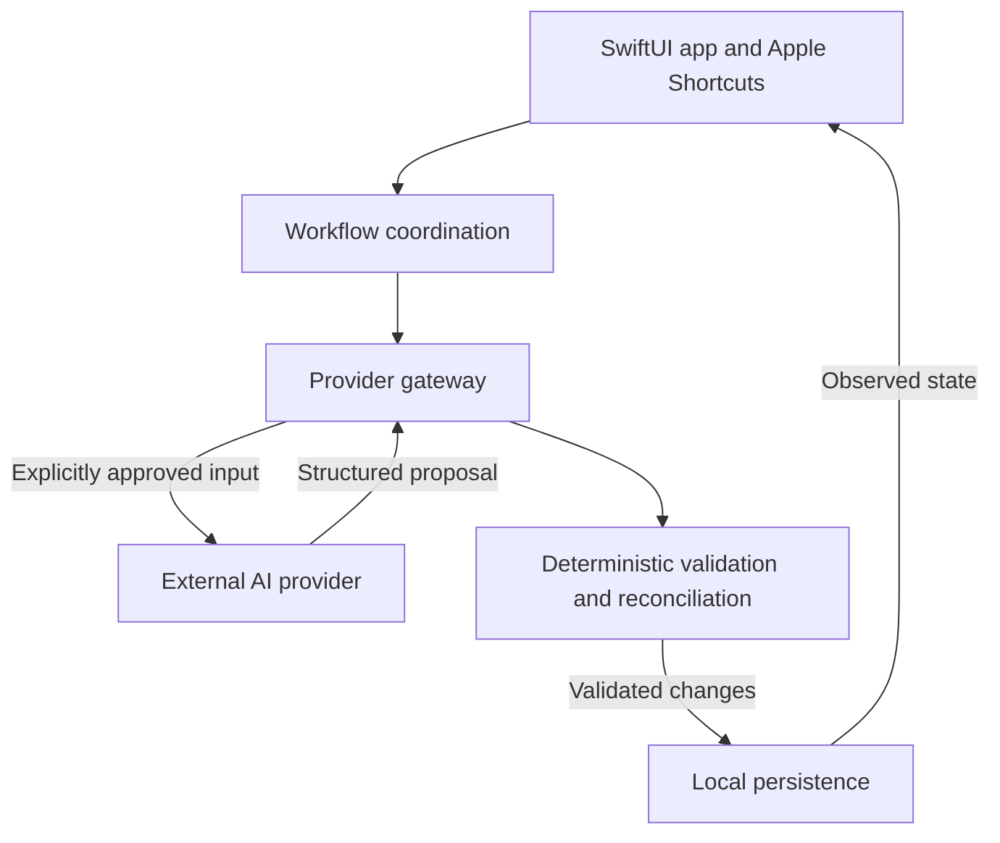
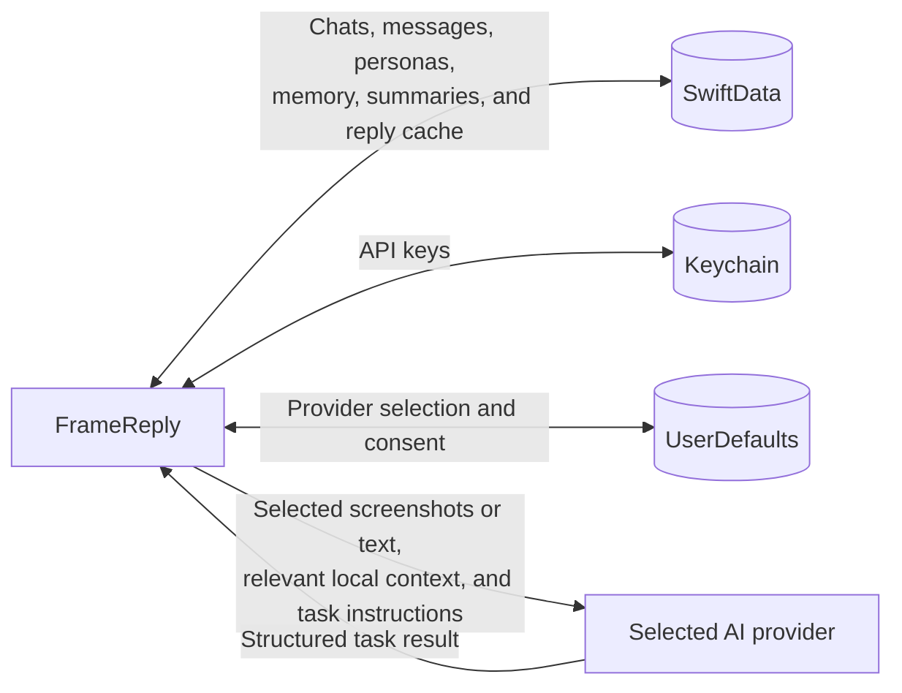
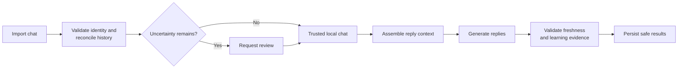

# Architecture

FrameReply is a local-first app with two entry points: its SwiftUI interface and Apple Shortcuts. Both use the same workflows for importing conversations and generating replies.

AI output is always a **proposal**. Local code validates identity, evidence, freshness, and persistence rules before the output can change stored data.

## Responsibilities

| Boundary | Responsibility |
| --- | --- |
| SwiftUI and Shortcuts | Collect input, display persisted state, and start workflows. |
| Workflow coordination | Assemble context and sequence provider, validation, and persistence work. |
| Provider gateway | Select a capable model and enforce credential and consent requirements. |
| External provider | Extract a transcript or propose replies and learned changes in a structured format. |
| Deterministic rules | Validate provider output, reject stale or unsafe changes, match chats, and reconcile history. |
| Local persistence | Commit related changes together and provide the observable source of truth. |

The project uses one application target organized by responsibility. These boundaries describe behavior and ownership; they are not separate framework modules.

## Data boundaries

- Chats and generated state stay in the protected local database and are excluded from device backups.
- API keys are device-only Keychain items. Provider selection and versioned consent contain no conversation content.
- FrameReply has no proxy server. Approved task input goes directly to the selected provider.
- Screenshot images are normalized before upload and are not retained after processing. Extracted messages may be stored locally.

## Core workflows

Import turns external conversation data into trusted local history. Reply generation reads that history and can propose replies, compact summaries, chat memory, and persona-style learning under separate evidence rules.

See [AI Workflows](ai-workflows.md) for the matching algorithm and the state rules shared by these workflows.

## Localization boundaries

`Localizable.xcstrings` is the app-owned presentation source of truth. `LocalizationContext` carries a resolved supported language into coordinators and prompt construction; there is no mutable global language manager.

Persistent identity is language-independent: chat titles are optional verbatim content, built-in personas and seed observations use stable IDs with optional user overrides, and suggested-reply caches use chat plus presentation language as their identity. Localized fallbacks are resolved only by projections. Imported text, names, user edits, provider brands, reply bodies, protocol fields, and diagnostic identifiers remain verbatim.

## Glossary

| Term | Meaning |
| --- | --- |
| **Provisional chat** | A newly imported conversation whose identity has not been confirmed. |
| **Unknown sender** | A message whose owner cannot be established safely from visible or remembered evidence. |
| **Participant alias** | A previously observed name for the same participant, scoped to one chat. |
| **Chat memory** | Durable, chat-specific context supported by messages from the other participant. |
| **Persona observation** | A reusable writing-style pattern learned from the user's own messages or supplied explicitly. |
| **One-use drafting input** | Optional context or a rough draft used for one generation without becoming history, memory, or persona learning. |

Tests are the detailed behavioral specification. These documents describe the stable mental model and invariants rather than individual implementation units.
