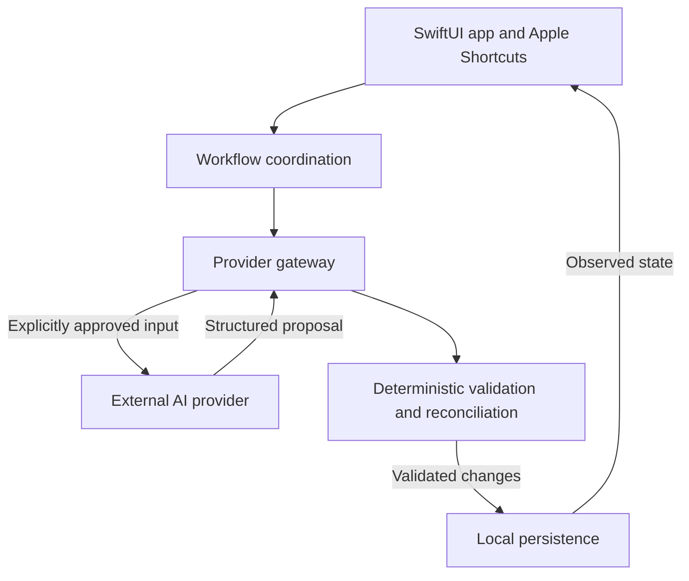
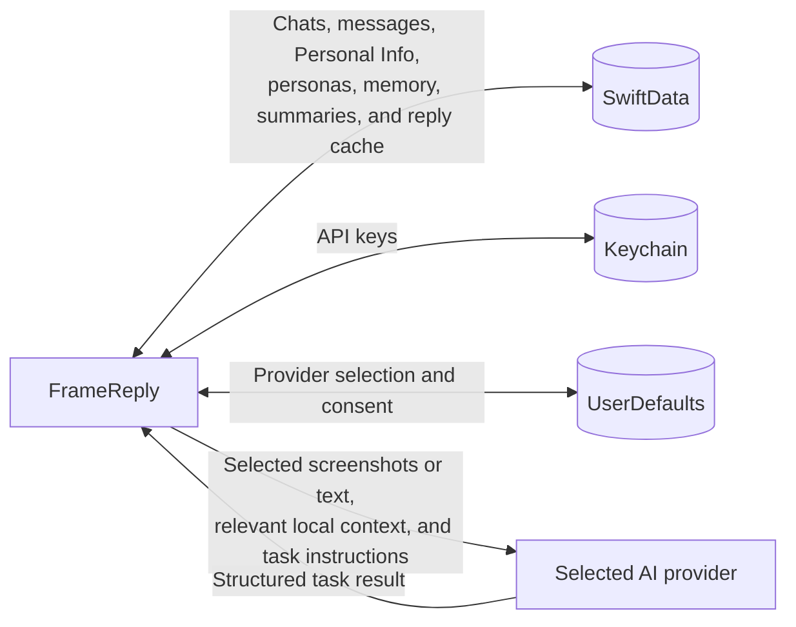
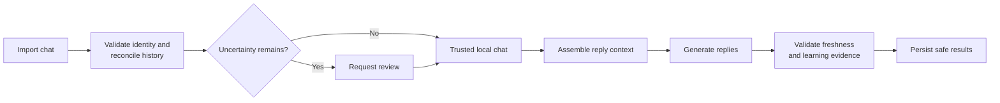

# Architecture

```mermaid
flowchart TB
    Entry[SwiftUI app and Apple Shortcuts]
    Workflow[Workflow coordination]
    Gateway[Provider gateway]
    Provider[External AI provider]
    Rules[Deterministic validation and reconciliation]
    Store[Local persistence]

    Entry --> Workflow
    Workflow --> Gateway
    Gateway -->|Explicitly approved input| Provider
    Provider -->|Structured proposal| Gateway
    Gateway --> Rules
    Rules -->|Validated changes| Store
    Store -->|Observed state| Entry
```

FrameReply is an iOS reply assistant that carries forward Direct- and Group-chat history and relevant context to generate two user-reviewed draft replies. Users can bring in screenshots or copied messages through the SwiftUI app or Apple Shortcuts; both entry points use the same import and generation workflows.

AI output is always a **proposal**. Local code validates identity, evidence, freshness, and persistence rules before the output can change stored data.

## Responsibilities

| Boundary | Responsibility |
| --- | --- |
| SwiftUI and Shortcuts | Collect input, display persisted state, and start workflows. |
| Workflow coordination | Assemble context and sequence provider, validation, and persistence work. |
| Provider gateway | Select a capable model and enforce credential and consent requirements. |
| External provider | Extract a transcript or propose replies and learned changes in a structured format. |
| Deterministic rules | Validate provider output, reject stale or unsafe changes, match chats, and reconcile history. |
| Local persistence | Commit related changes together and provide the observable source of truth. |

The project uses one application target organized by responsibility. These boundaries describe behavior and ownership; they are not separate framework modules.

## Data boundaries

```mermaid
flowchart LR
    App[FrameReply]
    SwiftData[(SwiftData)]
    Keychain[(Keychain)]
    Defaults[(UserDefaults)]
    Provider[Selected AI provider]

    App <-->|Chats, messages, Personal Info,<br/>personas, memory, summaries, and reply cache| SwiftData
    App <-->|API keys| Keychain
    App <-->|Provider selection and consent| Defaults
    App -->|Selected screenshots or text,<br/>relevant local context, and task instructions| Provider
    Provider -->|Structured task result| App
```

- Chats and generated state stay in the protected local database and are excluded from device backups.
- API keys are device-only Keychain items. Provider selection and versioned consent contain no conversation content.
- FrameReply has no proxy server. Approved task input goes directly to the selected provider.
- Screenshot images are normalized before upload and are not retained after processing. Extracted messages may be stored locally.

## Core workflows

```mermaid
flowchart LR
    Import[Import chat] --> Reconcile[Validate identity and<br/>reconcile history]
    Reconcile --> Review{Uncertainty remains?}
    Review -->|Yes| Human[Request review]
    Review -->|No| Trusted[Trusted local chat]
    Human --> Trusted
    Trusted --> Context[Assemble reply context]
    Context --> Generate[Generate replies]
    Generate --> Validate[Validate freshness<br/>and learning evidence]
    Validate --> Persist[Persist safe results]
```

Import turns external conversation data into trusted local history. The app derives conversation type from validated structural evidence, conservatively treating ambiguous nonempty fragments as Direct. Reply generation reads that history and can propose replies, compact summaries, chat memory, Personal Info, and persona-style learning under separate evidence rules. AI-authored chat memory is available in Direct and Group chats; users can edit or add context in either kind.

See [AI Workflows](ai-workflows.md) for the matching algorithm and the state rules shared by these workflows.

## Localization boundaries

`Localizable.xcstrings` is the source of truth for FrameReply-owned localized content, and `AppShortcuts.xcstrings` owns Siri invocation phrases. `Bundle.main.preferredLocalizations` reflects the supported per-app language selected by iOS and supplies `LocalizationContext` to coordinators and prompt construction. The App Language row opens FrameReply's iOS Settings page; the app does not keep a separate language preference or switch languages in process.

Persistent identity is language-independent: chat titles are optional verbatim content, built-in personas and seed observations use stable IDs with optional user overrides, and suggested-reply caches use chat plus app language as their identity. Localized fallbacks are resolved only by projections. FrameReply-authored strategy and rationale use the resolved app language; summaries and AI chat memory follow their supporting conversation evidence. Imported text, names, user edits, provider brands, reply bodies, protocol fields, and diagnostic identifiers remain verbatim.

## Glossary

| Term | Meaning |
| --- | --- |
| **Conversation kind** | The locally derived or user-selected Direct, Group, or Unknown classification. Ambiguous imported fragments default to Direct; saved Group chats are never downgraded by an ambiguous import. |
| **Provisional chat** | A newly imported conversation whose identity has not been confirmed. |
| **Unknown sender** | A message whose owner cannot be established safely from visible or remembered evidence. |
| **Participant alias** | A previously observed name for the single non-user participant in a Direct chat, scoped to that chat. Group sender names remain message-scoped labels rather than stable identities. |
| **Chat memory** | A short, atomic, chat-specific fact or confirmed shared plan. AI-authored memory follows the language and script of its supporting messages; manually managed context remains verbatim. When source messages provide names, the memory includes the relevant participant names so it remains attributable if the conversation type later changes. |
| **Personal Info** | Account-wide durable details about the user, learned only from confirmed user-authored messages or entered directly. It supplies optional factual context, not writing style. |
| **Persona observation** | A reusable writing-style pattern learned from the user's own messages or supplied explicitly. |
| **One-use drafting input** | Optional context or a rough draft used for one generation without becoming history, memory, or persona learning. |

Tests are the detailed behavioral specification. These documents describe the stable mental model and invariants rather than individual implementation units.
