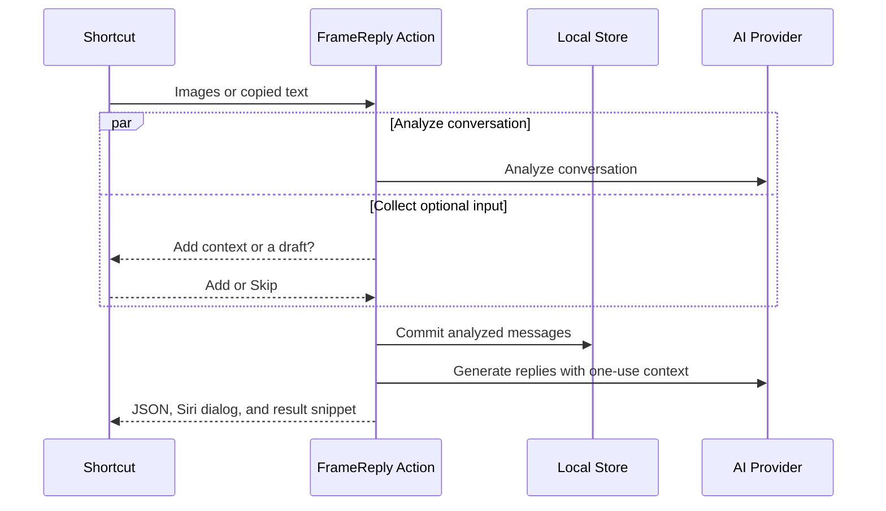

# Shortcut Maintenance and Troubleshooting

FrameReply publishes two personal shortcuts from a team-controlled Apple account. Keep their public links in `ShortcutInstallationCatalog` and verify both links on a device that has not previously installed them before every release. Missing links leave installation unavailable but must not prevent the app from opening.

## Supported Inputs and Limits

FrameReply accepts conversation context through its in-app **Add Messages** flow and through the two Shortcuts documented below.

- Image import accepts 1–8 still PNG, JPEG, or HEIC images from one chat. Images are normalized to a maximum 3,072-pixel edge, stripped of metadata, and bounded to 5 MB each and 20 MB for the request.
- Text import accepts at most 8,000 characters across 40 text items and approximately 25 messages.
- Context or draft accepts at most 500 user-perceived characters. Empty or whitespace-only input is treated as Skip.
- **FrameReply Images** accepts shared images or captures the current screen when run without input.
- **FrameReply Text** accepts shared plain text or reads the clipboard when run directly.

Use only conversation content that you are authorized to process. Imported messages remain stored locally; normalized source images are discarded after processing. See the [Privacy Policy](privacy.md) for the provider data flow and retention details.

## End-to-End Workflow



The new actions pass context directly to reply generation. Context never becomes chat history, memory, or persona learning. Analysis begins before the context choice is complete, but persistence waits for that choice. Canceling before persistence saves nothing.

Import and reply generation are separate outcomes. A saved import remains successful when reply generation is unavailable or fails.

On iOS 26, the result snippet shows the chat, import/review status, two replies, a copy action for each reply, and **Review Import** or **Open Chat**. The action also returns JSON for downstream automation and a short spoken dialog for Siri.

The legacy **Analyze Chat Images**, **Analyze Chat Text**, and **Generate Suggested Replies** actions remain executable for existing shortcuts for at least two releases. Do not use them in newly published shortcuts.

## FrameReply Images

Configure **FrameReply Images** to show in the Share Sheet and accept **Images** only. Set its no-input behavior to **Continue**.

```text
Receive Images from Share Sheet
              │
              ▼
       Were images received?
          ┌───┴────┐
         Yes       No
          │         │
Use Shortcut Input  Take Screenshot
          └────┬────┘
               ▼
Suggest Replies from Chat Images
```

The conditional must return all items from `Shortcut Input` in its true branch and the screenshot in its false branch. Connect the conditional result to **Suggest Replies from Chat Images**. The action presents its own result, so do not add Show Result.

## FrameReply Text

Enable **Show in Share Sheet**, accept **Text** only, and set the no-input behavior to **Get Clipboard**. Do not accept **Anything**.

```text
Receive Text from Share Sheet
If there is no input: Get Clipboard
              ↓
Suggest Replies from Chat Text
```

Compatible apps can pass shared plain text directly. A normal launch reads the clipboard. WhatsApp may display the shortcut without supplying selected message text, so its supported workflow is **select messages → Share → Copy → run FrameReply Text**. Do not advertise direct WhatsApp sharing unless a physical-device test confirms that `Shortcut Input` contains the selected transcript.

## Optional Context or Draft

Both end-to-end actions default **Ask for Context** to on. When no value is supplied, they offer **Add** and **Skip** while analysis runs. Choosing Add opens a multiline prompt reading **What do you want to say?** Submitting blank text is treated as Skip; cancelling before persistence stops the shortcut without saving an import.

Chat import remains successful if suggested replies are temporarily unavailable.

Automation builders can turn **Ask for Context** off or connect a fixed or variable **Context or Draft** value. A supplied value bypasses the prompt. Values over 500 characters fail before persistence instead of being truncated.

## Publishing Checklist

1. Build or update both shortcuts on the team-controlled device.
2. Confirm the image shortcut accepts Images only, handles shared and no-input runs, and preserves multiple selected images.
3. Confirm the text shortcut accepts Text only, imports shared plain text, and reads the clipboard on a normal launch.
4. Verify WhatsApp's Copy then run workflow. Inspect its direct Share Sheet payload before documenting direct support.
5. Publish each shortcut and copy its `https://www.icloud.com/shortcuts/...` URL into `ShortcutInstallationCatalog`.
6. Install both links on a clean device and run each workflow end to end.
7. Export fresh recovery copies after any workflow change.

Use **Stop Sharing** in Shortcuts to revoke a public installer. Deleting the local shortcut does not revoke its link.

## Recovery Copies

For each shortcut:

1. Open it in Shortcuts and choose **Share**.
2. Choose **Options → File → Anyone** and save the exported `.shortcut` file to secure team storage outside the app bundle.
3. Verify that another device can import the exported file.

## Back Tap

If the Back Tap banner covers the conversation title before a screenshot is taken, turn off **Settings → Accessibility → Touch → Back Tap → Show Banner**. The screenshot animation and FrameReply input prompt still confirm that the shortcut ran.

## Common Failures

- **Image shortcut does not appear when sharing:** confirm **Show in Share Sheet** is enabled and the accepted input type is **Images**.
- **A tap does not take a screenshot:** confirm no-input behavior is **Continue** and the false branch returns **Take Screenshot**.
- **Shared images trigger a screenshot:** confirm the true branch returns `Shortcut Input` and feeds the same Suggest Replies action.
- **Text shortcut does not appear when sharing:** confirm **Show in Share Sheet** is enabled, the accepted input type is **Text**, and the source app actually supplies plain text.
- **A normal text-shortcut run has no input:** copy usable message text first and confirm the no-input behavior is **Get Clipboard**.
- **WhatsApp shows FrameReply but imports old clipboard text:** use **Share → Copy**, close the Share Sheet, then run **FrameReply Text**; do not use the visible shortcut unless direct input has been verified on that device.
- **Installer unavailable in a development build:** publish the shortcuts and configure their canonical URLs. Missing URLs do not block app startup.
