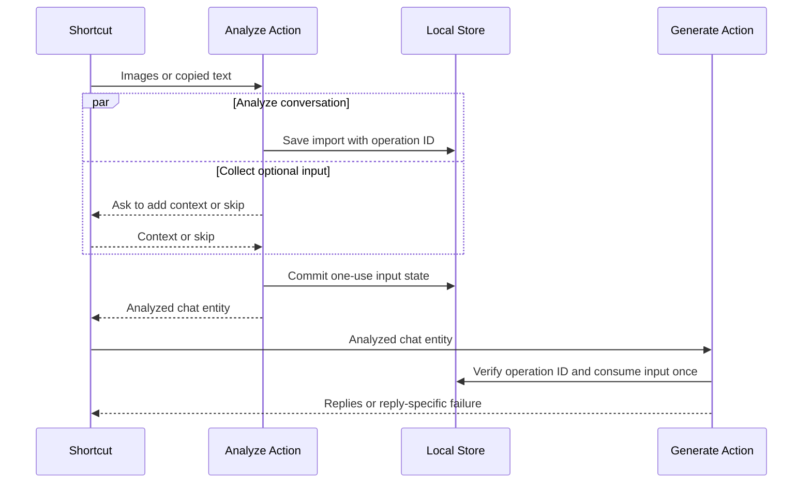

# Shortcut Maintenance and Troubleshooting

Zeptly publishes two personal shortcuts from a team-controlled Apple account. Keep their public links in `ShortcutInstallationCatalog` and verify both links on a device that has not previously installed them before every release. Missing links leave installation unavailable but must not prevent the app from opening.

## Workflow Handoff



The operation ID prevents data from different Shortcut runs from being mixed. Submitted context is consumed once and expires after 15 minutes; it never becomes chat history, memory, or persona learning.

Import and reply generation are separate outcomes. A saved import remains successful when reply generation is unavailable or fails.

## Zeptly Images

Configure **Zeptly Images** to show in the Share Sheet and accept **Images** only. Set its no-input behavior to **Continue**.

```text
Receive Images from Share Sheet
              │
              ▼
       Were images received?
          ┌───┴────┐
         Yes       No
          │         │
Use Shortcut Input  Take Screenshot
          └────┬────┘
               ▼
      Analyze Chat Images
               ▼
 Generate Suggested Replies
               ▼
          Show Result
```

The conditional must return all items from `Shortcut Input` in its true branch and the screenshot in its false branch. Connect the conditional result to the single **Analyze Chat Images** action.

## Zeptly Text

Enable **Show in Share Sheet**, accept **Text** only, and set the no-input behavior to **Get Clipboard**. Do not accept **Anything**.

```text
Receive Text from Share Sheet
If there is no input: Get Clipboard
              ↓
      Analyze Chat Text
              ↓
Generate Suggested Replies
              ↓
          Show Result
```

Compatible apps can pass shared plain text directly. A normal launch reads the clipboard. WhatsApp may display the shortcut without supplying selected message text, so its supported workflow is **select messages → Share → Copy → run Zeptly Text**. Do not advertise direct WhatsApp sharing unless a physical-device test confirms that `Shortcut Input` contains the selected transcript.

## Optional Context or Draft

Both Analyze actions offer **Add Context or Draft** and **Skip** while analysis runs. Choosing Add opens a multiline prompt. Submitting blank text is treated as Skip; cancelling stops the shortcut. Submitted text is used once and expires after 15 minutes if the workflow is abandoned.

Chat import remains successful if suggested replies are temporarily unavailable.

## Publishing Checklist

1. Build or update both shortcuts on the team-controlled device.
2. Confirm the image shortcut accepts Images only, handles shared and no-input runs, and preserves multiple selected images.
3. Confirm the text shortcut accepts Text only, imports shared plain text, and reads the clipboard on a normal launch.
4. Verify WhatsApp's Copy then run workflow. Inspect its direct Share Sheet payload before documenting direct support.
5. Publish each shortcut and copy its `https://www.icloud.com/shortcuts/...` URL into `ShortcutInstallationCatalog`.
6. Install both links on a clean device and run each workflow end to end.
7. Export fresh recovery copies after any workflow change.

Use **Stop Sharing** in Shortcuts to revoke a public installer. Deleting the local shortcut does not revoke its link.

## Recovery Copies

For each shortcut:

1. Open it in Shortcuts and choose **Share**.
2. Choose **Options → File → Anyone** and save the exported `.shortcut` file to secure team storage outside the app bundle.
3. Verify that another device can import the exported file.

## Back Tap

If the Back Tap banner covers the conversation title before a screenshot is taken, turn off **Settings → Accessibility → Touch → Back Tap → Show Banner**. The screenshot animation and Zeptly input prompt still confirm that the shortcut ran.

## Common Failures

- **Image shortcut does not appear when sharing:** confirm **Show in Share Sheet** is enabled and the accepted input type is **Images**.
- **A tap does not take a screenshot:** confirm no-input behavior is **Continue** and the false branch returns **Take Screenshot**.
- **Shared images trigger a screenshot:** confirm the true branch returns `Shortcut Input` and feeds the same Analyze action.
- **Text shortcut does not appear when sharing:** confirm **Show in Share Sheet** is enabled, the accepted input type is **Text**, and the source app actually supplies plain text.
- **A normal text-shortcut run has no input:** copy usable message text first and confirm the no-input behavior is **Get Clipboard**.
- **WhatsApp shows Zeptly but imports old clipboard text:** use **Share → Copy**, close the Share Sheet, then run **Zeptly Text**; do not use the visible shortcut unless direct input has been verified on that device.
- **Installer unavailable in a development build:** publish the shortcuts and configure their canonical URLs. Missing URLs do not block app startup.
