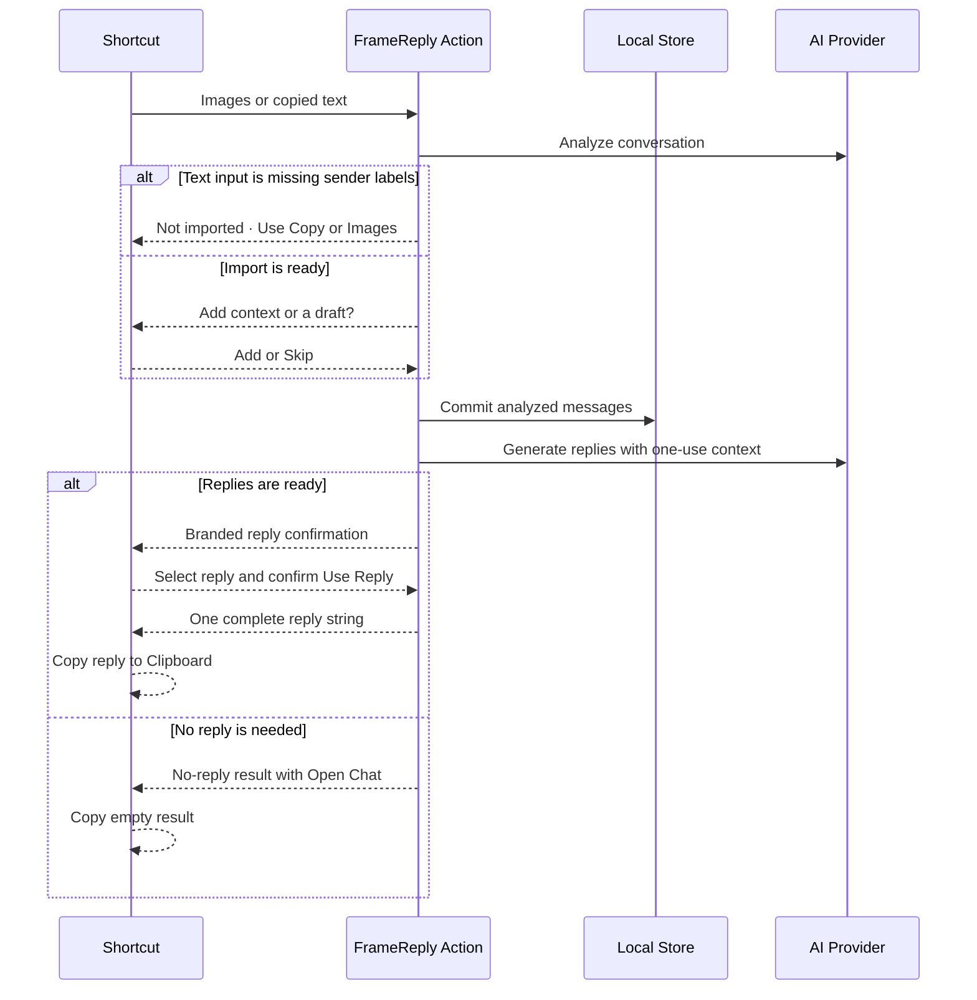

# Shortcut Maintenance and Troubleshooting

FrameReply publishes two personal shortcuts from a team-controlled Apple account. Keep their public links in `ShortcutInstallationCatalog` and verify both links on a device that has not previously installed them before every release. Missing links leave installation unavailable but must not prevent the app from opening.

## Supported Inputs and Limits

FrameReply accepts conversation context through its in-app **Add Messages** flow and through the two Shortcuts documented below.

- Image import accepts 1–8 still PNG, JPEG, or HEIC images from one chat. Images are normalized to a maximum 3,072-pixel edge, stripped of metadata, and bounded to 5 MB each and 20 MB for the request.
- Text import accepts at most 8,000 characters and approximately 50 messages. Every message must include an author label or a resolved sender role; timestamps are optional.
- Context or draft accepts at most 500 user-perceived characters. Empty or whitespace-only input is treated as Skip.
- **FrameReply Images** accepts shared images or captures the current screen when run without input.
- **FrameReply Text** accepts shared plain text or reads the clipboard when run directly.

Use only conversation content that you are authorized to process. Imported messages remain stored locally; normalized source images are discarded after processing. See the [Privacy Policy](privacy.md) for the provider data flow and retention details.

## End-to-End Workflow


```mermaid
sequenceDiagram
    participant Shortcut
    participant Action as FrameReply Action
    participant Store as Local Store
    participant Provider as AI Provider

    Shortcut->>Action: Images or copied text
    Action->>Provider: Analyze conversation
    alt Text input is missing sender labels
        Action-->>Shortcut: Not imported · Use Copy or Images
    else Import is ready
        Action-->>Shortcut: Add context or a draft?
        Shortcut-->>Action: Add or Skip
    end
    Action->>Store: Commit analyzed messages
    Action->>Provider: Generate replies with one-use context
    alt Replies are ready
        Action-->>Shortcut: Branded reply confirmation
        Shortcut-->>Action: Select reply and confirm Use Reply
        Action-->>Shortcut: One complete reply string
        Shortcut-->>Shortcut: Copy reply to Clipboard
    else No reply is needed
        Action-->>Shortcut: No-reply result with Open Chat
        Shortcut-->>Shortcut: Copy empty result
    end
```

The new actions pass context directly to reply generation. Context never becomes chat history, memory, or persona learning. Image analysis begins before the context choice is complete. Text analysis first verifies that every message has sender metadata, then offers the context choice. Canceling before persistence saves nothing.

Import and reply generation are separate outcomes. A saved import remains successful when reply generation is unavailable or fails.

The two published personal shortcuts use **Suggest Replies from Chat Images** and **Suggest Replies from Chat Text**. Each action displays a branded confirmation snippet without opening FrameReply. The first reply is initially selected; tapping either reply moves the checkmark and strengthens that card’s outline. **Use Reply** returns only that complete, untruncated reply to the shortcut. The next native **Copy to Clipboard** action copies it.

When no reply is needed, the actions show **No reply needed right now.** and return an empty string, so no advisory text is copied. Preserving the existing clipboard requires guarding Copy in the published shortcuts.

The snippet’s header action opens the imported chat. When the import needs review, it opens the Review Import flow; otherwise it opens the chat normally. Opening FrameReply intentionally leaves the current app and abandons that reply-selection confirmation. Normal selection and copying remain entirely in the Shortcuts overlay.

The legacy **Analyze Chat Images**, **Analyze Chat Text**, and **Generate Suggested Replies** actions remain executable for existing shortcuts for at least two releases. Do not use them in newly published shortcuts.

## FrameReply Images

1. Create a shortcut named **FrameReply Images**.
2. Open **Details**, enable **Show in Share Sheet**, accept **Images** only, and set **If There’s No Input** to **Continue**.
3. Add an **If** action whose input is `Shortcut Input` and whose condition is **has any value**.
4. In the **If** branch, set the variable `Chat Images` to `Shortcut Input`.
5. In the **Otherwise** branch, take one screenshot and set `Chat Images` to the screenshot output.
6. After **End If**, add **Suggest Replies from Chat Images** and set **Chat Images** to the `Chat Images` variable.
7. Leave **Ask for Context** enabled unless the shortcut is intentionally noninteractive.
8. Add **Copy to Clipboard** immediately after it, using the FrameReply action’s result.
9. Do not add **Choose from List**, **If**, **Show Result**, or a clipboard action from FrameReply.

Final structure:

```text
Receive Images from Share Sheet
If Shortcut Input has any value
    Set Chat Images to Shortcut Input
Otherwise
    Take Screenshot
    Set Chat Images to Screenshot
End If
Suggest Replies from Chat Images using Chat Images
Copy Suggested Reply to Clipboard
```

Test a normal run and confirm exactly one screenshot is captured. Then share 1–8 images and confirm every selected image is used without taking another screenshot. Select each reply in turn, tap **Use Reply**, and paste it into a long text field to confirm that the complete, untruncated string was copied. Tap the header action separately and confirm it opens the correct chat or review flow.

## FrameReply Text

1. Create a shortcut named **FrameReply Text**.
2. Open **Details**, enable **Show in Share Sheet**, accept **Text** only, and set **If There’s No Input** to **Get Clipboard**.
3. Add **Suggest Replies from Chat Text** and set **Chat Text** to `Shortcut Input`.
4. Leave **Ask for Context** enabled unless the shortcut is intentionally noninteractive.
5. Add **Copy to Clipboard** immediately after it, using the FrameReply action’s result.
6. Do not add **Choose from List**, **If**, **Analyze Chat Text**, **Generate Suggested Replies**, or **Show Result**.

Final structure:

```text
Receive Text from Share Sheet
If there is no input: Get Clipboard
Suggest Replies from Chat Text using Shortcut Input
Copy Suggested Reply to Clipboard
```

Test both directly shared text and a normal run that reads previously copied message text. Every message must retain an author label; timestamps are optional. After confirming a reply, paste it into the original messaging app and confirm FrameReply was not opened.

Direct sharing remains supported when the messaging app includes sender labels. If direct sharing is unavailable or FrameReply reports that sender labels were not shared, select the messages and choose **Copy** or **Share → Copy**, then run **FrameReply Text**. If the copied text also omits labels, use **FrameReply Images**. Verify WhatsApp and Telegram copied-message imports, and Telegram direct sharing, after app updates.

## Optional Context or Draft

Both Suggest Replies actions default **Ask for Context** to on. When no value is supplied, they offer **Add** and **Skip**. For text input, this happens only after sender metadata validation. Choosing Add opens a multiline prompt reading **What do you want to say?** Submitting blank text is treated as Skip; cancelling before persistence stops the shortcut without saving an import.

Chat import remains successful if suggested replies are temporarily unavailable.

Automation builders can turn **Ask for Context** off or connect a fixed or variable **Context or Draft** value. A supplied value bypasses the prompt. Values over 500 characters fail before persistence instead of being truncated.

## Publishing Checklist

1. Build or update both shortcuts on the team-controlled device.
2. Confirm the image shortcut accepts Images only, handles shared and no-input runs, and preserves multiple selected images.
3. Confirm generated replies can be selected, return complete text after **Use Reply**, and open the correct chat or Review Import flow from the header.
4. Confirm no-reply results show **No reply needed right now.**, open the correct chat, copy no advisory text, and leave the clipboard empty.
5. Confirm unavailable replies stop before **Copy to Clipboard**.
6. Confirm the text shortcut accepts Text only, imports labeled shared or copied text, and reads the clipboard on a normal launch.
7. Confirm metadata-poor text shows the cancellation prompt, saves nothing, and stops before **Copy to Clipboard**. Test WhatsApp and Telegram on a physical device.
8. Copy and verify each shortcut's iCloud link.
9. Install each link on a device where that shortcut is not already installed and run it end to end.
10. Add only the verified `images` and `text` URLs to `ShortcutInstallationCatalog`.
11. Export fresh recovery copies after any workflow change.

Use **Stop Sharing** in Shortcuts to revoke a public installer. Deleting the local shortcut does not revoke its link.

Apple references:

- [Enable a shortcut in the Share Sheet](https://support.apple.com/guide/shortcuts/apd163eb9f95/ios)
- [Limit shortcut input and choose no-input behavior](https://support.apple.com/guide/shortcuts/apd8195f96d6/ios)
- [Use If actions and If Result](https://support.apple.com/guide/shortcuts/apd83dcd1b51/ios)
- [Use variables](https://support.apple.com/guide/shortcuts/apdd02c2780c/ios)
- [Use Copy to Clipboard without opening another app](https://support.apple.com/guide/shortcuts/apd081d9d61f/ios)
- [Display static and interactive App Intent snippets](https://developer.apple.com/documentation/appintents/displaying-static-and-interactive-snippets)
- [Share shortcuts through iCloud](https://support.apple.com/guide/shortcuts/apdf01f8c054/ios)

## Recovery Copies

For each shortcut:

1. Open it in Shortcuts and choose **Share**.
2. Choose **Options → File → Anyone** and save the exported `.shortcut` file to secure team storage outside the app bundle.
3. Verify that another device can import the exported file.

## Back Tap

If the Back Tap banner covers the conversation title before a screenshot is taken, turn off **Settings → Accessibility → Touch → Back Tap → Show Banner**. The screenshot animation and FrameReply input prompt still confirm that the shortcut ran.

## Common Failures

- **Image shortcut does not appear when sharing:** confirm **Show in Share Sheet** is enabled and the accepted input type is **Images**.
- **A tap does not take a screenshot:** confirm no-input behavior is **Continue** and the false branch stores the **Take Screenshot** output in `Chat Images`.
- **Shared images trigger a screenshot:** confirm the true branch stores `Shortcut Input` in `Chat Images` and that the variable feeds the Suggest Replies action.
- **Text shortcut does not appear when sharing:** confirm **Show in Share Sheet** is enabled, the accepted input type is **Text**, and the source app actually supplies plain text.
- **A normal text-shortcut run has no input:** copy usable message text first and confirm the no-input behavior is **Get Clipboard**.
- **Text was not imported because sender labels were not shared:** use **Share → Copy**, then run **FrameReply Text**. If the copied text still has no sender labels, use **FrameReply Images**.
- **A generated-reply run shows Done or copies JSON:** rebuild FrameReply and re-add the Suggest Replies action to refresh its metadata. Generated replies should show **Use Reply** and return one reply string.
- **The selected card changes but nothing is copied:** tap **Use Reply**, then confirm native **Copy to Clipboard** immediately follows the Suggest Replies action and uses its output.
- **Selecting Review opens FrameReply:** this is intentional. Use the reply cards and **Use Reply** to stay in the current app.
- **WhatsApp direct sharing is unavailable:** select multiple messages, choose **Copy** or **Share → Copy**, then run **FrameReply Text**.
- **Installer unavailable in a development build:** publish the shortcuts and configure their canonical URLs. Missing URLs do not block app startup.
